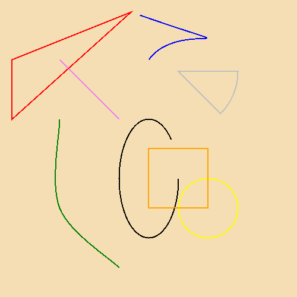
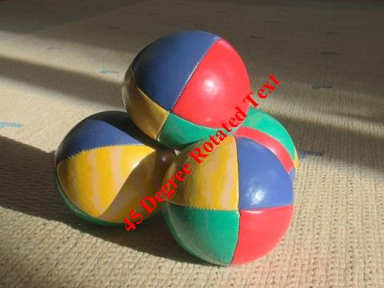

## **Adding a Watermark**
This document explains how to add a watermark to an image using Aspose.Imaging. Adding a watermark to an image is a common requirement for image processing applications. This example uses the Graphics class to draw a string on the image surface.

To demonstrate the operation, we will load a BMP image from disk and draw a string as the watermark on the image surface using the [Graphics](/pages/createpage.action?spaceKey=imagingjava&title=com.aspose.imaging.Graphics+class&linkCreation=true&fromPageId=15303006) class' drawString method. We'll save the image to PNG format using the PngOptions class.

Below is a code example that demonstrates how to add a watermark to an image. The example source code has been split into parts to make it easy to follow. Step by step, the examples show how to:

1. Load an image.
1. Create and initialize a Graphics object.
1. Create and initialize Font and SolidBrush objects.
1. Draw a string as watermark using the Graphics class' DrawString method.
1. Save image to PNG.

**Image Template**

**Input image** 

### **Program Samples**
**1. Loading an Image**

First, create an Image class object to load the sample image from disk.



**2. Creating and Initializing a Graphic Object**

After loading the image, create and initialize a Graphics class object.



**3. Creating and Initializing Font and SolidBrush Objects**

Now create, initialize and set the various properties of the Font and SolidBrush instances. These objects will be used as parameters for the drawString object for drawing the string watermark.



**Drawing a String**

Then using the Graphics class' drawString method, add a string to the image. There are several overloads of the drawString method which accepts a string, Font class object, Brush class object and a coordinate pair of points as a parameter.



**Saving the Image**

Finally, save the image back to the local disk as a PNG file using the PngOptions class.



The output of the above source code sample is as below.

**Output image** 

### **Complete Source**

## **Adding a Diagonal Watermark**
Adding a diagonal watermark to an image is similar to adding a horizontal watermark as discussed above, with a few differences. To demonstrate the operation, we will load a JPG image from disk, add transformations using an object of [Matrix](/pages/createpage.action?spaceKey=imagingjava&title=Matrix+Class&linkCreation=true&fromPageId=15303006) class and draw a string as the watermark on the image surface using the [Graphics](/pages/createpage.action?spaceKey=imagingjava&title=com.aspose.imaging.Graphics+class&linkCreation=true&fromPageId=15303006) class' drawString method.

Below is a code example that demonstrates how to add a diagonal watermark to an image. The example source code has been split into parts to make it easy to follow. Step by step, the examples show how to:

1. Load an image.
1. Create and initialize a Graphics object.
1. Create and initialize Font and SolidBrush objects.
1. Get size of image in SizeF object.
1. Create an instance of Matrix class and perform composite transformation.
1. Assign transformation to Graphics object.
1. Create and initialize a StringFormat object.
1. Draw a string as watermark using the Graphics class' drawString method.
1. Save resultant image.

**Image Template**

### **Program Samples**
**1. Loading an Image**

First, create an Image class object to load the sample image from disk.



**2. Creating and Initializing a Graphic Object**

After loading the image, create and initialize a Graphics class object.



**3. Creating and Initializing Font and SolidBrush Objects**

Now create, initialize and set the various properties of the Font and SolidBrush instances. These objects are used as parameters for the drawString object for drawing the string watermark.



**4. Getting Image dimensions in an Object of Size**

Create an instance of Size and store image dimensions in it. Image height and width will be used to perform translation on the Matrix object.



**5. Creating an Instance of Matrix Object, and Applying Transformations**

Using object of Matrix class, call methods translate and rotate. translate method accepts offset values for vertical & horizontal coordinates, and applies the specified translation vector to the Matrix object. Rotate method applies a clockwise rotation of an amount specified in the angle parameter, around the origin (zero x and y coordinates) for the Matrix instance.



**6. Assigning Matrix Transformations to Graphics Object**

Object of Matrix class represents a composite transformation. Assign this transformation to Graphics Object.



**7. Creating and Initializing StringFormat Object**

StrinfFormat class encapsulates text layout information such as alignment, orientation. Set the Alignment and FormatFlag attributes for the StringFormat object.



**8. Drawing a String**

Then using the Graphics class' drawString method, add a string to the image. Use overload of the drawString method which accept a string, Font class object, Brush class object and a coordinate pair of points as a parameter and object of StringFormat.



**9. Saving the Image**

Finally, save the image back to the local disk.


### **Complete Source**


The output of the above source code sample is as below.
### **Output**

