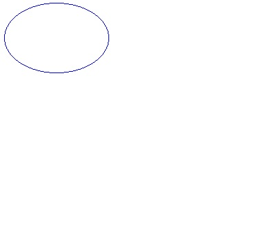

## **Drawing Lines**
This example uses [Graphics](http://www.aspose.com/api/java/imaging/com.aspose.imaging/classes/Graphics) class to draw the line shapes on the Image surface. To demonstrate the operation, the example creates a new image in BMP format and draws lines on the image using the Graphics class' drawLine method.

First, we will create an object of the BmpOptions class from the [com.aspose.imaging.imageoptions](http://www.aspose.com/api/java/imaging/com.aspose.imaging.imageoptions/index) package and set its various properties. The most important property is the setSource property, the setSource property actually determines where the image data will reside (file or stream) and in this case it is a stream. After setting these properties, pass this object to the static create method of image class.

Once the image has been created, we will use the clear method exposed by the Graphics class to set its background color.

The drawLine method of the Graphics class is used to draw a line on an image connecting two point structures. This method has several overloads accepting the instance of Pen class and coordinates pairs of points or Point/PointF structures as arguments. Pen Class defines an object used to draw lines, curves and figures. The Pen class has several overloaded constructors to draw lines with specified color, width & brush.



**Note:** The **SolidBrush** class is used for drawing continuously with specific color.

The SolidBrush class is used for drawing continuously with specific color. The output of the above source code sample is as below,

|| |
| :- | :- |
## **Drawing Ellipse**
This example uses the [Graphics](http://www.aspose.com/api/java/imaging/com.aspose.imaging/classes/Graphics) class to draw an ellipse shape on the image surface. To demonstrate the operation, the example creates a new image in BMP format and draws ellipse shape using the Graphics class' drawEllipse method.

The drawEllipse method of the Graphics class is used to draw an ellipse shape on an image surface specified by the bounding rectangle structure. This method has several overloads that accept an instances of the Pen and Rectangle/RectangleF classes or a pair of coordinates, a height, and a width as arguments.

The [Pen](http://www.aspose.com/api/java/imaging/com.aspose.imaging/classes/Pen) class defines an object used to draw lines, curves and figures. The Pen class has several overloaded constructors to draw lines with specified color, width & brush.

The Rectangle class stores a set of four integers that represent the location and size of a rectangle. The [Rectangle](http://www.aspose.com/api/java/imaging/com.aspose.imaging/classes/Rectangle) class has several overloaded constructors that can draw a rectangle structure with specified size and location.

The process is as follows:

1. Create an object of the BmpOptions class from the com.aspose.imaging.imageoptions package and set its properties.
   The most important property is the setSource property which determines where the image data resides (file or stream). In the example below, it is a stream.
1. Pass the BmpOptions object to the [Image](http://www.aspose.com/api/java/imaging/com.aspose.imaging/classes/Image) class' static create method.
1. Once the image has been created, use the clear method exposed by the Graphics class to set its background color.



**Note**: The [SolidBrush](http://www.aspose.com/api/java/imaging/com.aspose.imaging.brushes/classes/SolidBrush) class is used to draw continuously with a specific color.

The SolidBrush class is used for drawing continuously with specific color. The output of the above source code sample is as below,

|| |
| :- | :- |
## **Drawing Rectangle**
This example uses the [Graphics](http://www.aspose.com/api/java/imaging/com.aspose.imaging/classes/Graphics) class to draw the rectangle shape on the image surface. To demonstrate the operation, the example creates a new image in BMP format and draws a rectangle the image using the Graphics class' drawRectangle method.

The [Graphics](http://www.aspose.com/api/java/imaging/com.aspose.imaging/classes/Graphics) class' drawRectangle method is used to draw a rectangle shape on an image specified by the rectangle structure. This method has several overloads that accept instances of the [Pen](http://www.aspose.com/api/java/imaging/com.aspose.imaging/classes/Pen) and [Rectangle](http://www.aspose.com/api/java/imaging/com.aspose.imaging/classes/Rectangle) and [RectangleF](http://www.aspose.com/api/java/imaging/com.aspose.imaging/classes/RectangleF) classes or coordinate pair, a width, and a height as arguments.

The Pen class defines an object used to draw lines, curves and figures. The Pen class has several overloaded constructors for drawing lines with specified color, width and brush.

The [Rectangle](http://www.aspose.com/api/java/imaging/com.aspose.imaging/classes/Rectangle) class Stores a set of four integers that represent the location and size of a rectangle. The Rectangle class has several overloaded constructors to draw the rectangle structure with specified size and location.

The process is as follows:

1. Create an object of the [BmpOptions](http://www.aspose.com/api/java/imaging/com.aspose.imaging.imageoptions/classes/BmpOptions) class from the [com.aspose.imaging.imageoptions](http://www.aspose.com/api/java/imaging/com.aspose.imaging.imageoptions/index) package and set its properties.
   The most important property is the setSource property which determines where the image data will reside (file or stream). Here, it is a stream.
1. Pass the BmpOptions object to the Image class' static create method.
1. Once the image has been created, use the Graphics class' clear method to set its background color.



**Note**: The [SolidBrush](http://www.aspose.com/api/java/imaging/com.aspose.imaging.brushes/classes/SolidBrush) class is used for drawing continuously with specific color.

|| |
| :- | :- |
## **Drawing Arc**
In this session of drawing shape series, we will draw the arc shape on the image surface. We will use the Graphics class' drawArc method to demonstrate the operation on a BMP image.

The drawArc method of the Graphics class is used to draw arc shape on an image surface. drawArc represent a portion of an ellipse specified by the rectangle structure. This method has several overloads accepting the instances of the Pen classes and Rectangle/RectangleF structure or a pair of coordinates, a width, and a height as arguments. Pen Class defines an object used to draw lines, curves and figures. The Pen class has several overloaded constructors to draw lines with specified color, width & brush.

The process is as follows:

1. Create an object of the [BmpOptions](http://www.aspose.com/api/java/imaging/com.aspose.imaging.imageoptions/classes/BmpOptions) class from the [com.aspose.imaging.imageoptions](http://www.aspose.com/api/java/imaging/com.aspose.imaging.imageoptions/classes/BmpOptions) package and set its properties.
   The most important property is the setSource property which determines where the image data will reside (file or stream). Here, it is a stream.
1. Pass the BmpOptions object to the Image class' static create method.
1. Once the image has been created, use the Graphics class' clear method to set its background color.



The output of the above source code sample is as below,

|| |
| :- | :- |
## **Drawing Images using Core Functionality**
Aspose.Imaging is an imaging library that offers many valuable features including creating images from scratch. Draw using the core functionality like manipulating an image's bitmap information, or use the advanced features like Graphics and GraphicsPath to draw shapes on image surface with the help of different brushes and pens.

**Core Drawing Features**

Using Aspose.Imaging's RasterImage class, you can retrieve an image area's pixel information to manipulate it. The RasterImage class contains the entire core drawing functionality, like getting and setting pixels and other methods for image manipulation.

Create a new image using any of the methods described in [Creating Files](/pages/createpage.action?spaceKey=imagingjava&title=Creating+Image+files&linkCreation=true&fromPageId=15303066) and assign it to an instance of the RasterImage class.

Use the RasterImage class' loadPixels method to retrieve the pixel information of a portion of an image. Once you have an array of pixels, you can manipulate it by, for example, changing the color of each pixel. After manipulating the pixel information, set it back to the desired area in the image using the RasterImage class' savePixels method.

The code examples below demonstrates this process.


## **Drawing Images using Graphics**
With the Aspose.Imaging library you can draw simple shapes like lines, rectangles and circles, as well as complex shapes like polygons, curves, arcs and Bezier shapes.

Aspose.Imaging library creates such shapes using [Graphics](http://www.aspose.com/api/search/net/imaging/Graphics) class that resides in the Aspose.Imaging namespace. Graphics objects are responsible for performing different drawing operations on an image, thus changing the image's surface.

The [Graphics](http://www.aspose.com/api/search/net/imaging/Graphics) class uses a variety of helper objects to enhance the shapes:

- Pens, to draw lines, outline shapes, or render other geometric representations.
- Brushes, to define how areas are filled in.
- Fonts, to define the shape of characters of text.

**Drawing with the Graphics Class**

Below is a code example demonstrating the use of the [Graphics](http://www.aspose.com/api/search/java/imaging/Graphics) class. The example source code has been split into several parts to keep it simple and easy to follow. Step by step, the examples show how to:

1. Create an image.
1. Create and initialize a [Graphics](http://www.aspose.com/api/search/java/imaging/Graphics) object.
1. Clear the surface.
1. Draw an ellipse.
1. Draw a filled polygon and save the image.

Each steps is shown in C# and Visual Basic. The output image looks like the one below

The output image, showing the ellipse and polygon drawn by the code

|| |
| :- | :- |
**Creating an Image**

Start by creating an image using any of the methods described in [Creating Files](http://www.aspose.com/docs/display/imagingjava/Drawing+and+Formatting+Images#DrawingandFormattingImages-CreatingImageFiles).



**Drawing with the Graphics Class**

Below is a code example demonstrating the use of the Graphics class. The example source code has been split into several parts to keep it simple and easy to follow. Step by step, the examples show how to:

1. Create an image.
1. Create and initialize a Graphics object.
1. Clear the surface.
1. Draw an ellipse and save the image.

Each steps is shown below. The output image looks like the one below.

**The output image, showing the ellipse drawn by the code** 

**Drawing Images using GraphicsPath**

The [GraphicsPath](http://www.aspose.com/api/java/imaging/com.aspose.imaging/classes/GraphicsPath) class is responsible for creating and maintaining a graphics path. The [GraphicsPath](http://www.aspose.com/api/java/imaging/com.aspose.imaging/classes/GraphicsPath) has no reference to an image and does not change the image itself, instead, it can be considered an object that contains metadata that describes the paths that the Graphics class can draw.

The GraphicsPath class uses figures; each figure is either composed of a sequence of connected lines and curves or a geometric shape primitive. Each shape may be split into shape segments. You can add, remove and change different figures or shapes in a GraphicsPath object.

When the GraphicsPath has been fully described, use the corresponding Graphics class methods (drawPath and fillPath) to draw over or fill the paths. The Graphics class takes each shape segment and draws it to produce the final image.

Start by creating an image using any of the methods described in [Creating Files](/pages/createpage.action?spaceKey=imagingjava&title=Creating+Image+files&linkCreation=true&fromPageId=15303066).


