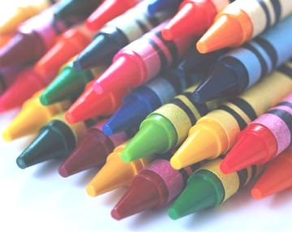
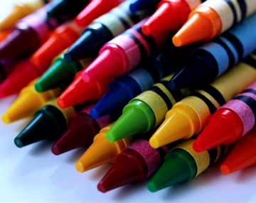
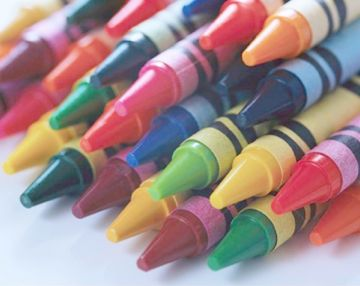

## **Dithering for Raster Images**
Dithering is a technique of creating the illusion of new colors and shades by varying the pattern of dots that actually create an image. It is the most common means of reducing the color range of images down to the 256 (or fewer) colors.

Aspose.Imaging provides the dithering support for RasterImage class by introducing dither method that accepts two parameters. First is of type DitheringMethod to be applied with two possible options FloydSteinbergDithering and ThresholdDithering. The second parameter to Dither method is the BitCount in integer.

{} 

BitCount defines the sampling size for the dithering result. Default value is 1 that represents black and white, whereas allowed values are 1, 4, 8 generating palettes with 2, 4 and 256 colors respectively.

{} 


## **Adjusting Brightness, Contrast and Gamma**
Color adjustments in digital images is one of the core features that most of the imaging libraries provide. Color adjustments can be categorized in the following.

1. **Brightness** refers to the lightness or darkness of color. Increasing the brightness of an image lights out all colors whereas decreasing the brightness darkens all colors.
1. **Contrast** refers to making the objects or details within an image more obvious. Increasing the contrast of an image increases the difference between light and dark areas so that the light areas becomes lighter and dark areas becomes darker. Decreasing the contrast will make lighter and darker areas stay approximately the same but the overall image becomes more homogeneous.
1. **Gamma** optimizes the contrast and brightness of the indirect lighting that is illuminating an object in the image.
### **Adjusting Brightness**
Aspose.Imaging for Java API provide adjustBrightness method for the RasterImage class that can be used to adjust the **Brightness** by passing an integer value as parameter.



Highest parameter value denotes to a brighter image.

Here is the original image and the resultant image for comparison.

### **Adjusting Contrast**
The adjustContrast method exposed by the RasterImage class can be used to adjust the **Contrast** of an image by passing a float value as parameter.



{} 

Highest parameter value denotes to a higher contrast in the given image.

{} 

Here is the original image and the resultant image for comparison.

### **Adjusting Gamma**
The adjustGamma method exposed by the RasterImage class has two versions. One of the overloads accept one float value and performs the **Gamma** correction for red, blue & green channel coefficients. Whereas the other overload accepts three float parameters representing each color coefficient separately.



Here is the original image and the resultant image for comparison.

## **Blur an Image**
This article demonstrates the usage of Aspose.Imaging for Java to perform Blur effect on an image. Aspose.Imaging API have exposed efficient & easy to use methods to achieve this goal.

Aspose.Imaging for Java has exposed the **GaussianBlurFilterOptions** class to create blur effect on the fly. **GaussianBlurFilterOptions** class need radius and sigma values to create blur effect on an image.

The steps to perform Resize are as simple as below:

1. Load an image using the factory method Load exposed by Image class.
1. Convert the image into **RasterImage**.
1. Create an instance of **GaussianBlurFilterOptions** class with default constructor or provide radius and sigma values in the constructor.
1. Call the RasterImage.Filter method while specifying rectangle as image bounds and **GaussianBlurFilterOptions** class instance.
1. Save the results.

The following code example demonstrates how to create blur effect on an image.


## **Verify Image Transparency**
This article demonstrates the usage of Aspose.Imaging for Java to check image transparency. The steps to check image transparency are as simple as below:

1. Load an image using the factory method Load exposed by Image class.
1. Check image opacity if opacity is zero image is transparent.
1. The following code example demonstrates how to check image is transparent or not.


## **Exporting Text as Shape While Converting EMF MetaFile**
Using Aspose.Imaging for Java, developers can get text as shapes while converting EMF to SVG format. This topic explains in detail how to convert text into shape while converting EMF to SVG format. Aspose.Imaging for Java provides the **TextAsShapes** property to get text as shape while converting EMF metafile. Below is the code demonstration of the said functionality.


## **Implement Lossy GIF Compressor**
This article demonstrates the usage of Aspose.Imaging for Java to apply  Lossy GIF Compressor on an image. Aspose.Imaging API have exposed efficient & easy to use methods to achieve this goal. Using this feature, developers can sets pixel difference. GIF's compression is based on a "dictionary" of strings of pixels seen. Normal encoder searches the dictionary for the longest string of pixels that exactly matches pixels in the image. Lossy encoder picks longest string of pixels that's "similar enough" to pixels in the image.

The following code example demonstrates how to apply GIF Compressor on an image.


## **Resizing WMF file while converting to PNG**
Using Aspose.Imaging for Java, developers can resize the WMF metafile while converting it to raster format. This topic explains the approach to load existing metafiles, resize it and convert it to raster format. Aspose.Imaging for Java provides the **Image** class to load WMF files and same can be used to resize and save the image to PNG format. The following code snippet shows you how to resize the WMF file while converting it to PNG.


## **Support For BMP**
Using Aspose.Imaging for Java, developers can load the BMP OS22XBITMAPHEADER. This header contains information specific to the bitmap data.


## **Support For DIB**
` `Aspose.Imaging now supports the Device-Independent Bitmap files. DIB file is similar to a BMP file, but has different header information. In the example below, an existing DIB file is loaded by passing the file path to the Image class static Load method.

The following code snippet shows you how to load a DIB file and convert it to PNG.


## **Support For Reading Pixel values of 48 bpp**
Using Aspose.Imaging for Java, developers can load 16-bit color components from TIFF RGB 48Bpp. Please note that only TIFF with the following options are supported:

- Color model: RGB 48Bpp or RGBA 64Bpp
- Compression: Lzw, Deflate, Uncompressed
- Byte order: Intel (Little Endian), Motorola (Big Endian).
- Striped/Tiled: Only Striped
- Planar Config: Contiguous, Separate

` `Embedded ICC Profile is not applied for 16-bit color components. Below is the code demonstration of the said functionality. 


## **Support For Change Window Size**
Using Aspose.Imaging for Java, developers can now change window size in Binarize Bradley method. Below is the code demonstration of the said functionality. 



