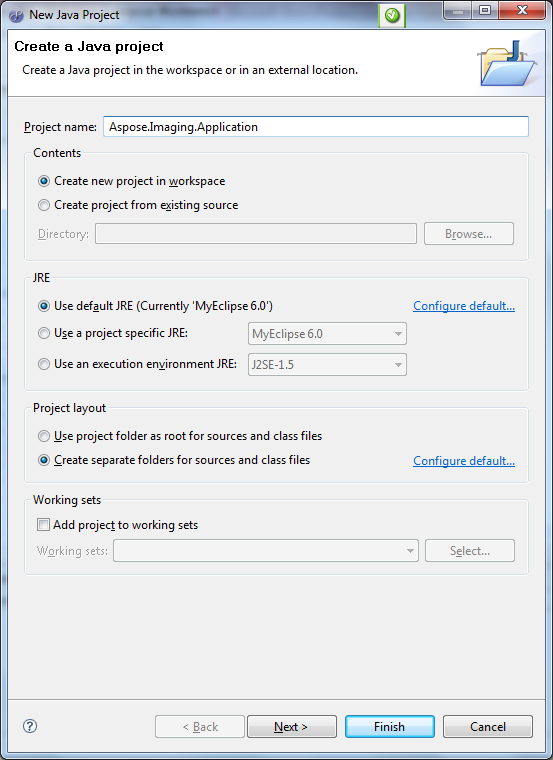
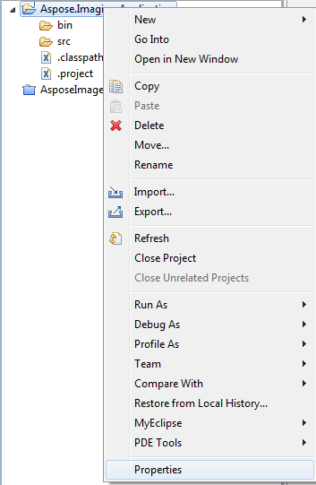
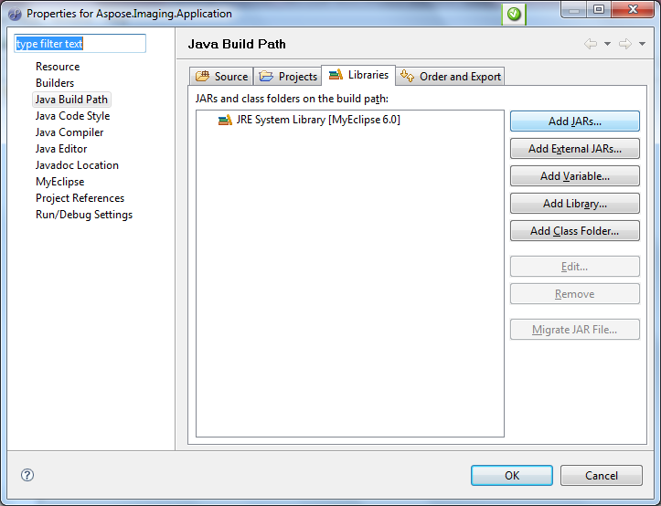
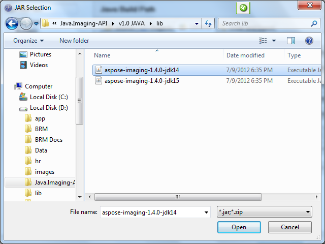

{} 

Aspose.Imaging is a flexible and easy to use API. This article shows, step by step, how to set up and write your very first Java application with Aspose.Imaging. The article uses MyEclipse, the steps for other IDEs are similar. The article gives a code example that creates a 500x500 pixel BMP image.

{} 

All Aspose components, when installed, work in [evaluation mode](/pages/createpage.action?spaceKey=imagingjava&title=Evaluation+Version+Limitations_Imaging&linkCreation=true&fromPageId=15302955). The evaluation mode has no time limit and it injects watermarks into the produced Images.
### **Creating an Application that Uses Aspose.Imaging**
To work with Aspose.Imaging in your applications:

1. [Download Aspose.Imaging](http://www.aspose.com/community/files/72/java-components/aspose.imaging_for_java/default.aspx).
1. [Create a project](/imaging/java/your-first-aspose-imaging-for-java-application-html/).
1. [Add a reference to the Aspose.Imaging API](/imaging/java/your-first-aspose-imaging-for-java-application-html/).
1. [Write the code](/imaging/java/your-first-aspose-imaging-for-java-application-html/).
#### **Download Aspose.Imaging for Java**
1. [Download Aspose.Imaging for Java](http://www.aspose.com/community/files/default.aspx).
1. Unzip the downloaded ZIP archive on your development computer, for example D:\Java.Imaging-API.
#### **Create Project**
1. Launch the MyEclipse IDE.
1. In the main toolbar, click **New Java Project**, or, from the **File** menu, select **New Java Project**.
1. Enter the project name.
1. Click **Finish**. 

   **Creating a project in MyEclipse** 

#### **Add Reference of Aspose.Imaging for Java API**
The project uses the Aspose.Imaging API as the core library for performing image operations. So, you have to reference the Aspose.Imaging JAR in the project .

1. Select the project's properties menu (right click on the project) as shown. 

   **Right-clicking the project opens a menu. The Properties option can be found at the bottom** 

1. Select the Java Build Path option.
1. Click **Add External Jar**. 

   **The project properties dialog** 

1. Select the Aspose.Imaging file to add it to the project. 

   **Adding the Aspose.Imaging JAR to the project** 

#### **Write MyClass.Java**
The next step is to create a new class.

1. Click on **New Java Class** in the main toolbar.
1. If not already specified, select HelloWorld/src as the source folder.
1. Type MyClass for the class name.
1. Select the option to create the main() method.
1. Click **Finish**.

The code below uses the Aspose.Imaging API to create an image from scratch.

{} 

All coding is done in the main() method of the MyClass.java class.

{} 


