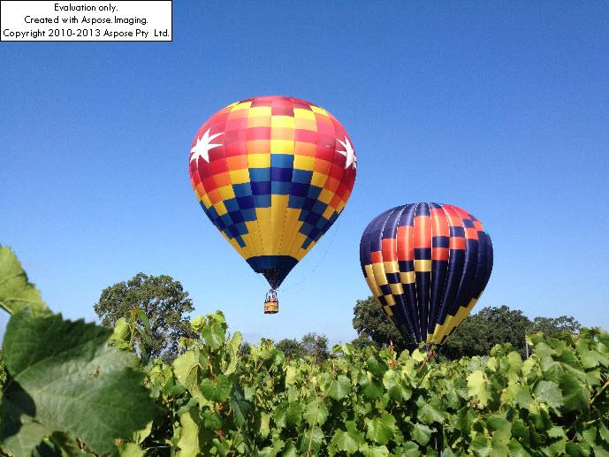

{} 

You can easily download an evaluation version of Aspose.Imaging for Java from the [download page](http://www.aspose.com/community/files/72/java-components/aspose.imaging-for-java/default.aspx). The evaluation version provides the same capabilities as the licensed version of the component. Furthermore, evaluation version simply becomes licensed when you purchase a license and add a couple of lines of code to apply the license.

The evaluation version of Aspose.Imaging (that is, the component running without a license applied) provides full Imaging functionality but it shows an evaluation watermark on the processed images and restrict the usage of core imaging features.

{} 

If you want to try Aspose.Imaging without evaluation version limitations, you can also request a 30-day temporary license. Please refer to [How to get a Temporary License?](http://www.aspose.com/corporate/purchase/temporary-license.aspx) for more information. 
