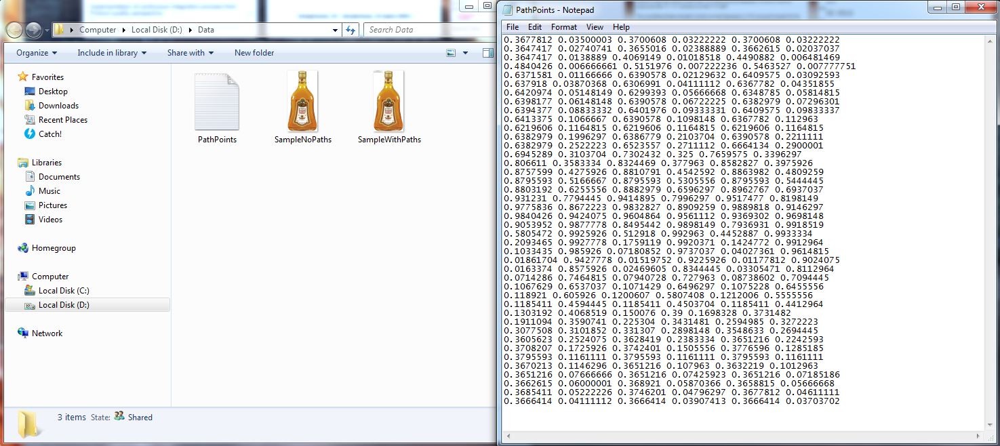
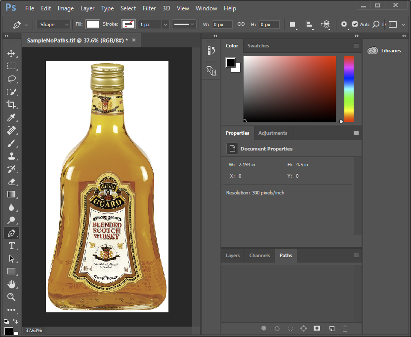
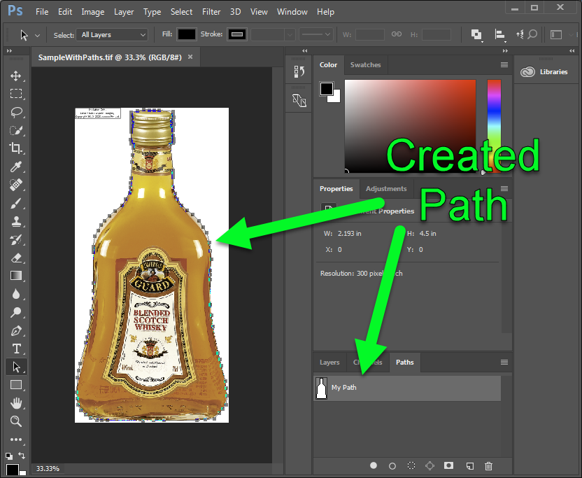
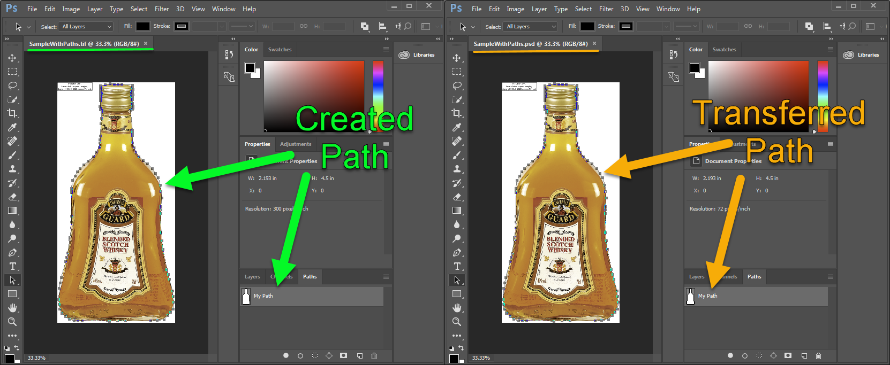

## Clipping Path

Clipping path is the Photoshop technique to remove the background from an image. Photoshop allows you to select a part of an image using Clipping Path  and save the path within a file. Clipping Paths allow you to hide the  part of an image you don't want to appear. Anything inside the clipping  path will be visible, but anything outside of it will be transparent.

Other words Photoshop makes it possible to isolate certain parts of an image, without permanently changing the layer. This allows you to tweak the  image at any point in the creative process. Clipping Paths are a  traditional method of cutting out objects or people in Photoshop that  allows you to create image files with transparent backgrounds. This  approach works best with objects or people with "hard" edges around the  object or person you want to cut out.

## Create Clipping Path in Tiff format

### File with Path points

In Data folder you can find a ***PathPoints.txt*** file. It contains *Bezier* points for our path. In your custom project you can create such points manually or use a *Photoshop Pen tool*.

### Sample Tiff image with no Paths inside

As you can see on screenshot, a ***Sample.tiff*** image has no any Paths. We will create a Path in Tiff image using *Aspose.Imaging* library and data in ***PathPoints.txt*** file.

## Create Clipping Path using Aspose.Imaging library

Please, use the following code to create a new path in our Tiff image:



Created Path should look like similar to the following screenshot:

## Transfer Clipping Path to Psd image during the export

Its quite helpful to use Paths in Psd images. You can easily transfer the Path using the following code:

The Path transferred to Psd image is identical to Tiff Path:

