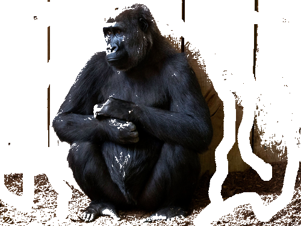

**Image masking** (simplified image segmentation) is the process of dividing image to background and foreground parts. It is widely used for recognition, diagnostics, computer vision.

Example of masked image with changed background is presented below.

|  |  |               |
| ------------------------------------------- | ------------------------------------------- | ---------------------------------------------------------- |
| Fig. 1 (a) Original image                   | (b) Manually masked image                   | (c) Automatically masked image with segmentation algorithm |

Here we can observe on figures 1 - b, c image masking results - background and foreground of initial image 1 - a.

Aspose.Imaging supports the following types of masking.

- Manual Masking - Using a set of ROIs as the mask. The ROIs for each slice are used to define the mask. Needed additional user input.
- Auto Masking - Automatic mode that does not require from user lot of input data, but can be not so accurate.  

Aspose.Imaging supports few automatic masking algorithms, among them: K-means, Watershed and Graph Cut algorithm (one of proposed automatic methods).

Below we can observe masking results of original image.

|*Original image*|1. *K-means image segmentation algorithm (Value metric : Color intensity)*|*2. K-means image segmentation algorithm (Value metric : Color intensity), **with indicating rectangular area for foreground***|3. *K-means image segmentation algorithm (Value metric : Color intensity * Euclidean distance)*|4. Marker-controlled Watershed algorithm|5. Graph Cut algorithm (with indicating areas by user)|
| :- | :- | :- | :- | :- | :- |
|  ||                       |                       |||
## **Manual masking**

The following code snippet provided below demonstrates how to apply manual masking to a raster image.



## **Auto masking**

The following code snippet provided below demonstrates how to apply auto masking to a raster image.







