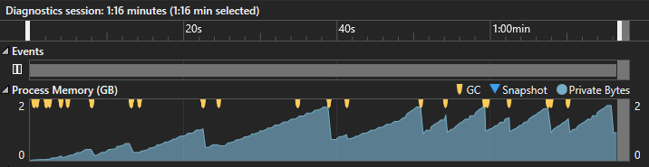

In the normal mode of operation, operations with multi-page images use the necessary available application memory, using it for operations on all pages. If the image has a lot of pages, and all of them are large, then the application will soon begin to use the maximum available memory. At the same time, in cases where the maximum available memory is insufficient to process all image pages, there will be a noticeable decrease in performance for this processing.

As an alternative solution for processing multi-page images, the sequential export mode was implemented. This approach implements the idea of "Loading a page into memory from an input stream --> processing a page (for example, a rotation operation) --> exporting a page to an output stream --> freeing memory --> loading the next page, and so on".

Sequential multi-page image export mode is activated by setting the delegate to the **IMultipageImage.PageExportingAction** property. In this delegate, the user can implement their logic to independently process each page. This delegate may not perform any actions, in this case only the image will be exported to the selected format, without performing additional actions on the image.

In the following example, in sequential export mode, all pages are also rotated 90 degrees beforehand:



The described scenario allows you to get rid of excessive use of application memory, while performing operations as fast as in standard mode.
## **Normal export mode**


Fig. 1 - Graph of memory consumption in standard export mode.
## **Sequential export mode**


Fig. 2 - Graph of memory consumption in sequential export mode.

The **Aspose.Imaging** currently supports sequential export in the following multi-page raster formats:

- For source images: **Tiff**, **Djvu** (i.e. only **TiffImage** and **DjvuImage** can be processed in sequential export mode);
- In image exporters: **Tiff**, **Gif**, **Apng**, **Dicom**, **WebP**.

In this way sequential exports are currently supported in the following combinations:

- from **Tiff** to **Tiff**;
- from **Tiff** to **Gif**;
- from **Tiff** to **Apng**;
- from **Tiff** to **Dicom**;
- from **Tiff** to **WebP**;
- from **Djvu** to **Tiff**;
- from **Djvu** to **Gif**;
- from **Djvu** to **Apng**;
- from **Djvu** to **Dicom**;
- from **Djvu** to **WebP**.

