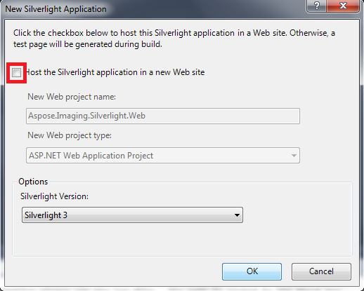
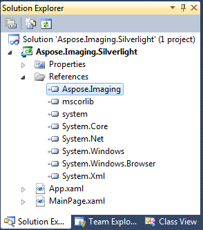
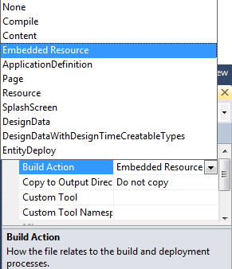

## **Integrate Aspose.Imaging for .NET with a Silverlight Application**
This document is provides a walkthrough of how to integrate the Aspose.Imaging for .NET API with Silverlight 3 Applications. This article goes through how to:

1. Download and install Aspose.Imaging for .NET
1. Create a Silverlight 3 project using Visual Studio 2010.
1. Add references to Aspose.Imaging to the Silverlight 3 assembly.
1. Create an image using the Aspose.Imaging API.
1. Apply the Aspose.Imaging license.
### **Silverlight 3 and Visual Studio 2010**
If you have installed Visual Studio 2010 there is no need to install the Silverlight 3 SDK separately: Visual Web Developer in Visual Studio 2010 supports Silverlight 3 development straight out of the box. It even includes the Silverlight 3 developer runtime and [Silverlight 3 SDK](http://go2.microsoft.com/fwlink/?LinkID=157102) build 3.0.40818.
### **The Demo Application**
To show how Aspose.Imaging for .NET can work with Silverlight, we have written a Silverlight 3 application that creates an image using Aspose.Imaging for .NET. The image is then exported out to the client’s machine in PSD format.
#### **Download and Install Aspose.Imaging**
1. [Download Aspose.Imaging for .NET](http://www.aspose.com/community/files/51/.net-components/aspose.imaging-for-.net/default.aspx).
1. [Install Aspose.Imaging for .NET](http://www.aspose.com/docs/display/imagingnet/Install+Aspose.Imaging+for+.NET).

All Aspose components run in evaluation mode until you apply a license. The evaluation mode has no time limit but adds watermarks to the images you output. Aspose components installed with an MSI installer are, by default, installed to:

- 32bit operating systems: **..** **/Program Files/Aspose/**
- 64bit operating systems: **..** **/Program Files (x86)/Aspose/**
#### **Create a Project**
Start Visual Studio 2010 and create a new Silverlight Application with .NET Framework 3.5. In this demonstration, the application is coded in C#. It could also be coded in Visual Basic. When you have clicked **OK** to the window as shown below, Visual Studio prompts you to create a web site to host your Silverlight application. You can choose not to create this web site; instead a test page will be generated to host the Silverlight application on run time. See the snapshot below,

#### **Add References to Aspose.Imaging to the Silverlight 3 Assembly**
The demo application uses the Aspose.Imaging API as the core library for perform image manipulation. For the API to be picked up you have to add a reference to the Aspose.Imaging assembly to your project.

#### **Create an image using the Aspose.Imaging API**
The application uses two files:

- MainPage.xaml - the mail application page.
- MailPage.xaml.cs - the underlying code that drives the actions on the page.
#### **Sample Code**
When you create the Silverlight project, Visual Studio IDE adds a default **MainPage.xaml** file, the Silverlight application's start page. You can modify this page or create a new one. MainPage.xaml holds the designer elements in an XML hierarchy. Below is a code snippet showing a button element on the canvas.



Actual coding is done in the **MainPage.xaml.cs** file which serves as the code behind the MainPage.xaml file. We have written a method that uses the Aspose.Imaging API to create an image from scratch. Then, on the button click event, the image is stored to a Stream object.


#### **Applying a License**
To apply a license, you need to add the license file to you project.

1. Right click the project, select **Add** and then **Add Existing Item**.
1. Browse to the license file's location.
1. In the **Properties** window, set the license file's **Build Action** of the license file to **Embedded Resource**. 

The license file has been added to the project as an embedded resource. You now need to access and apply it in the Silverlight application. The best place to apply an Aspose license in a Silverlight application is the **Application_Startup** event in the App.xaml.cs file. The following code snippet shows you how to apply a license as an embedded resource.


