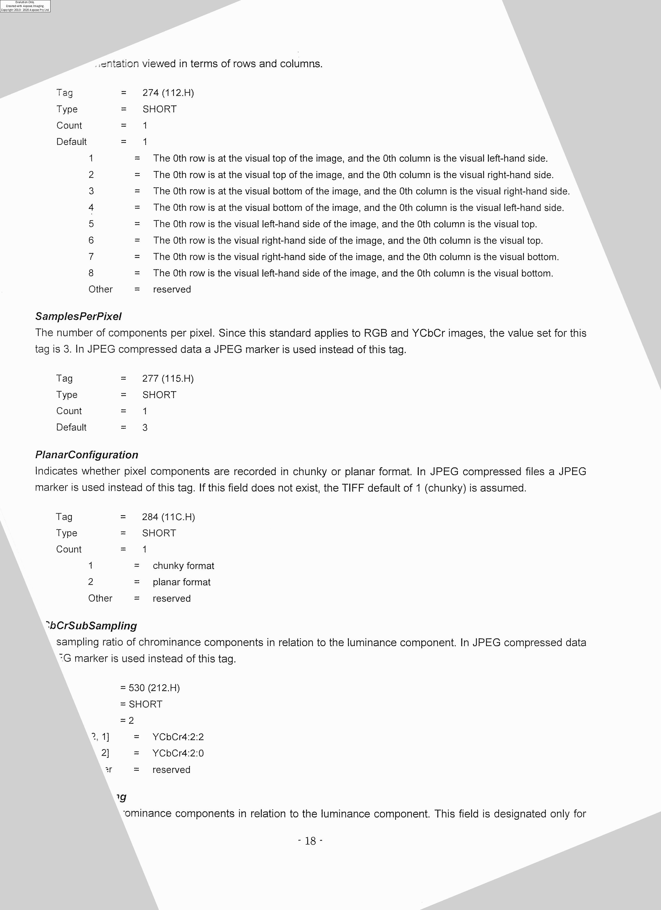

Skew is an artifact that might appear during document scanning process and it consists of getting the document’s text/images be rotated at a slight angle. It can have various causes but the most common are paper getting misplaced during a scan. Therefore, **deskew** is the process of detecting and fixing this issue on scanned files (ie, bitmap) so deskewed images will have the text/images correctly and horizontally aligned.

Deskewing an image can help a lot, if you want to improve the readability of scanned images. For example, think of a camera that automatically takes photos of goods with a barcode. If the skew angle is too high, the barcode can not be detected. After deskewing, the barcode can be read.



Below is an example of skewed scanned text and deskewed output.

|  |  |
| ------------------------------------------------------- | ------------------------------------------------------- |
| Skewed image                                            | Deskewed image                                          |