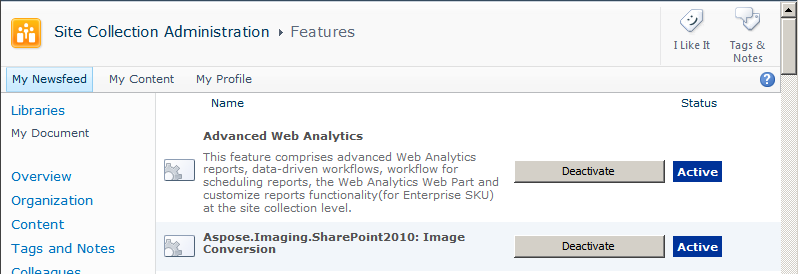

{} 

During installation, Aspose.Imaging for SharePoint is activated for all selected site collections. After installation, use the **Site Actions** menu at the root web site of a site collection to activate and deactivate Aspose.Imaging. 

{} 

Aspose.Imaging for SharePoint on a site collection

