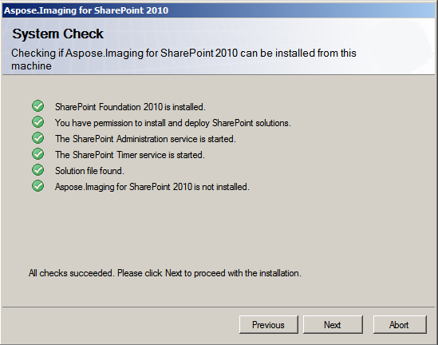
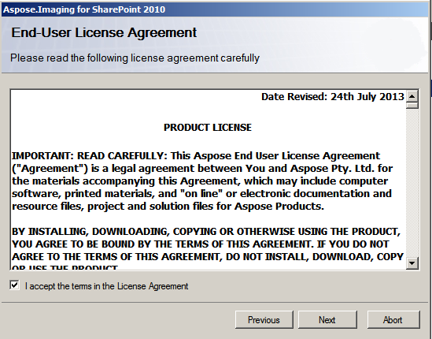
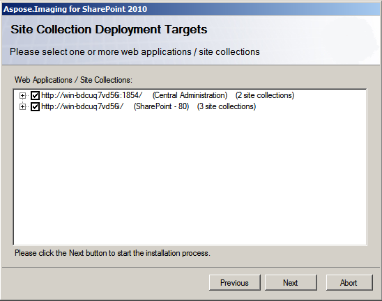
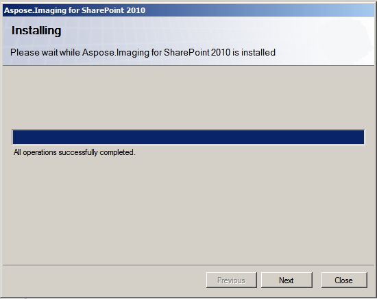
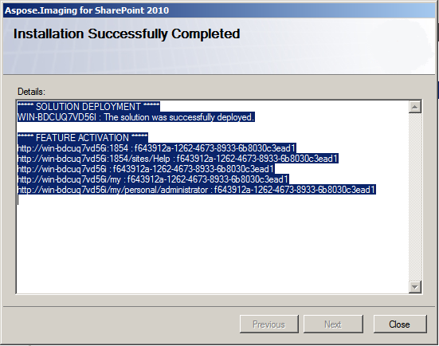

{} 

Aspose.Imaging for SharePoint is contained in a ZIP archive, **Aspose.Imaging.SharePoint.zip**, which can be downloaded from the [download page](http://www.aspose.com/community/files/73/sharepoint-components/aspose-imaging-for-sharepoint/default.aspx). 

{} 
#### **Archive Content**
The Aspose.Imaging.SharePoint.zip archive contains:

- **Aspose.Pdf.Imaging.wsp** 
  The SharePoint solution file. Aspose.Imaging for SharePoint is packaged as a SharePoint solution to facilitate deployment/retraction and feature activation/deactivation across the server farm.
- **Aspose_LicenseAgreement.rtf** 
  The End User License Agreement.
- **Aspose.Imaging for SharePoint.pdf** 
  User documentation with Public API reference.
- **setup.exe** 
  The setup program.
- **setup.exe.config** 
  The setup configuration file.
#### **Installation Checks**
The setup program checks the following conditions before proceeding:

- SharePoint 2010 is installed.
- The user has permission to install SharePoint solutions.
- SharePoint database is online.
- SharePoint Administration service is started.
- SharePoint Timer service is started.
  SharePoint Administration service and Timer service are needed because some setup actions rely on a timer job to propagate to all servers in the server farm.
#### **Installation Process**
To install Aspose.Pdf for SharePoint:

1. Unpack Aspose.Pdf.SharePoint zip to the local drive.
1. Run setup.exe and follow the instructions on the screen.

The setup program performs the following actions:

1. Checks the installation prerequisites.
   Setup will not continue if any check fails. 

1. Displays the End User License Agreement.
   Accept the agreement to proceed. 

1. Displays deployment target selection dialog.
   Selects web applications and site collections to activated Aspose.Imaging on. 

1. Deploys the feature to the server farm. 

1. Activates the feature for the selected site collections and configures their parent web applications.
1. Displays a list of web applications and site collections where the feature has been deployed and activated. 

