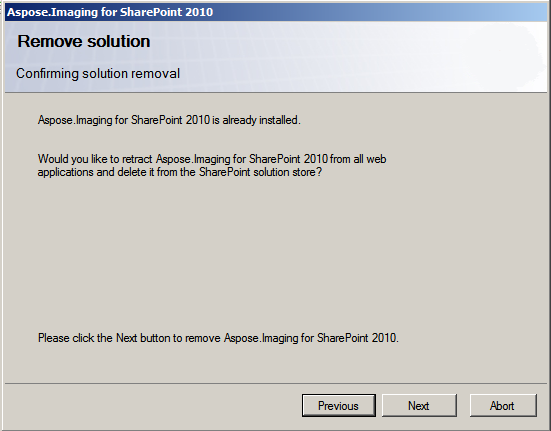

To uninstall Aspose.Imaging for SharePoint, run the setup program. If Aspose.Imaging for SharePoint is already installed, the setup program suggests removing it.

During un-installation, the setup program deactivates Aspose.Imaging for SharePoint for all site collections and retracts the solution from the server farm. 
