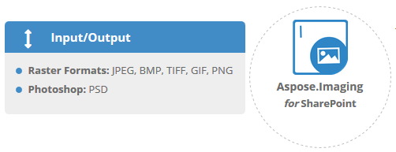

## **Supported File Formats**
**Aspose.Imaging for SharePoint provides support for following file formats**

- **Raster Formats: [JPEG2000](https://wiki.fileformat.com/Image/JP2/)**, [JPEG](https://wiki.fileformat.com/Image/JPEG/), [BMP](https://wiki.fileformat.com/Image/BMP/), [TIFF](https://wiki.fileformat.com/Image/TIFF/), [GIF](https://wiki.fileformat.com/Image/GIF/), [PNG](https://wiki.fileformat.com/Image/PNG/)
- **Photoshop: [PSD](https://wiki.fileformat.com/Image/PSD/)**

