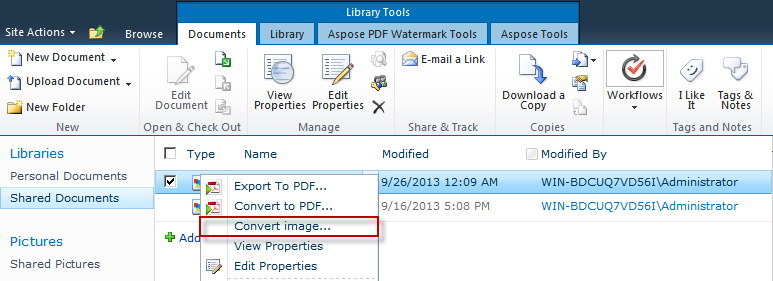
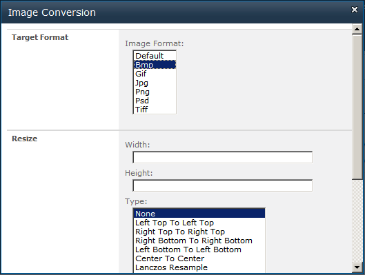

{} 

Aspose.Imaging for SharePoint enable users to convert an image, that is export it to another image format (PNG, JPG, BMP, GIF, TIFF and PSD) with reliability and high performance.

This task is done from the Image Conversion dialog. The Image Conversion dialog is also where you specify how to [crop](/imaging/sharepoint/crop-image-html/), [resize](/imaging/sharepoint/resize-image-html/) and [rotate or flip](/imaging/sharepoint/rotate-image-html/) an image. 

{} 
### **Converting Image**
Aspose.Imaging for SharePoint provides conversion feature via the contextual menu, the menu you get when you hover over a document in a list. To convert an image, use the **Convert Image** option from the menu as described below.

1. Select an image file from the document library.
1. Click **Convert Image** on the contextual menu. 

1. Select output image format from the **Target Format** field. 

1. Click **OK** to convert and save the file.
