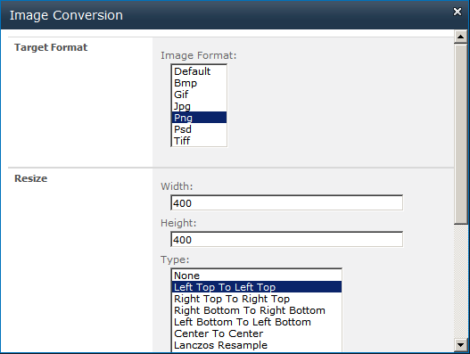

{} 

Aspose.Imaging for SharePoint user can easily crop an image (PNG, JPG, BMP, GIF, TIFF and PSD).

{} 
### **Cropping Image**
Aspose.Imaging for SharePoint provides the crop feature from the Image Conversion dialog. 

How the document is cropped depends on the **Resize Type** selection:

- None - the image stays the same size.
- Let Top To Left Top - crops from the top left corner.
- Right Top To Right Top - crops from the top right corner.
- Right Bottom to Right Bottom - crops from the bottom right corner.
- Lets Bottom To Left Bottom - crops from the bottom left corner.
- Center to Center - crop from the center of the image.

To crop an image:

1. Select an image file in a document library.
1. Click **Convert Image** from the contextual menu.
1. Select an output format from the **Target Format** field.
1. Enter the width and height crop parameters, and select a crop algorithm. 

1. Click **OK** to convert, crop and save the new file.
