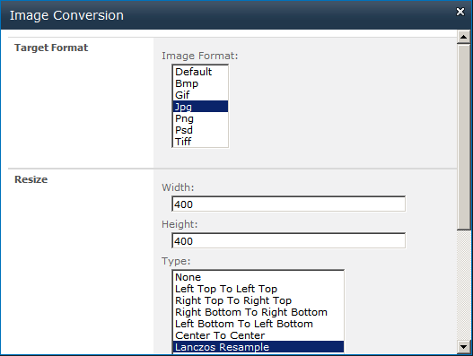

{} 

With Aspose.Imaging for SharePoint it is easy to resize an image (PNG, JPG, BMP, GIF, TIFF and PSD).

{} 
### **Resizing Image**
Aspose.Imaging for SharePoint provides the resize feature from the Image Conversion dialog. It allows you to specify a resampling option for the image too:

- [Nearest neighbour](http://en.wikipedia.org/wiki/Nearest-neighbor_interpolation)
- [Lanczos resample](http://en.wikipedia.org/wiki/Lanczos_resampling)

To resize an image:

1. Select an image file in the document library.
1. Click **Convert Image** on the contextual menu.
1. Select an image format from the **Target Format** field.
1. To resize, enter the width, height and resize algorithm. 

1. Click **OK** to convert, resize and save the new file.
