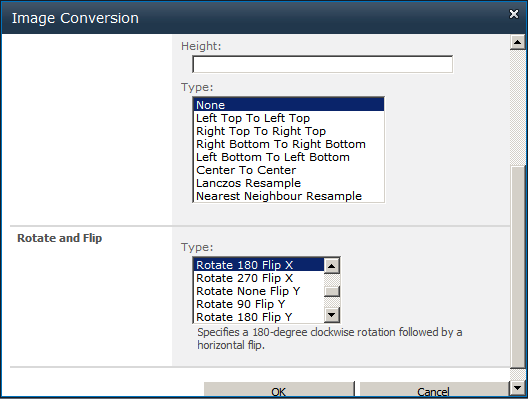

{} 

Aspose.Imaging for SharePoint can rotate and flip an image (PNG, JPG, BMP, GIF, TIFF and PSD).

{} 
### **Rotating Image**
Aspose.Imaging for SharePoint provides the rotate and flip feature from the **Image Conversion** dialog. There are a number of different options. For example:

- Rotate 180 Flip X - rotates the image 180 degrees clockwise and flips the image along the horizontal (X) axis.
- Rotate 90 Flip Y - rotates the image 90 degrees clockwise and flips it along the vertical (Z) axis.

|**Original image** |**Rotate 180 Flip X** |**Rotate None Flip Y** |
| :- | :- | :- |
||||
To rotate an image:

1. Select an image file in a document library.
1. Select **Convert Image** on the contextual menu.
1. Select the output image format from the **Target Format** field.
1. Select rotation or flip type from the **Rotate and Flip** field. 

1. Click **OK** to convert, rotate (or flip) and save the new file.
